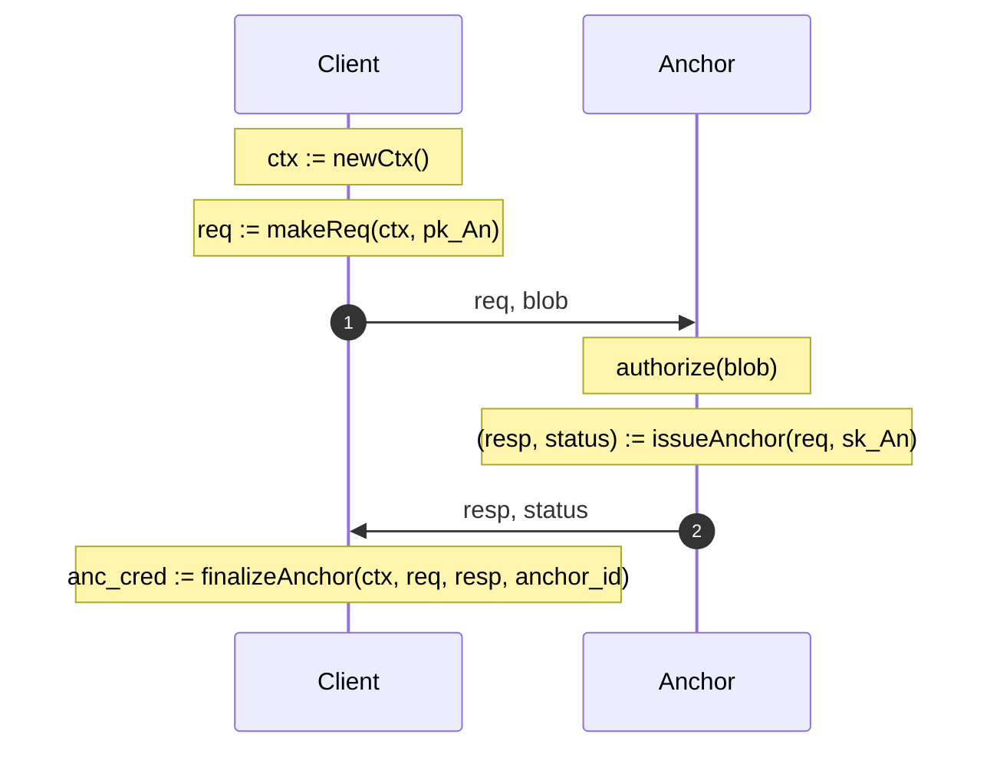
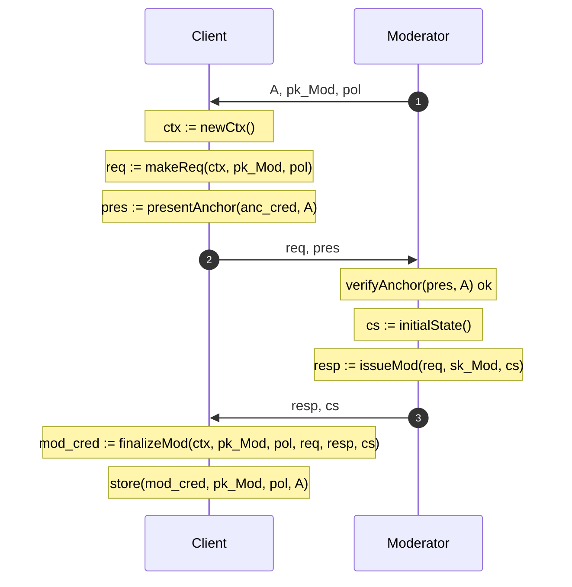
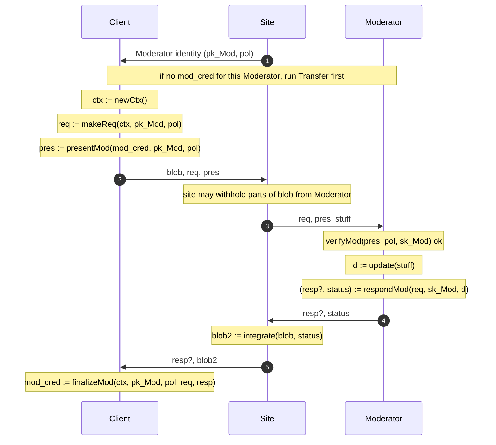

<!-- regenerate: off (set to off if you edit this file) -->

# MoLE Architecture

This is the working area for the individual Internet-Draft, "MoLE Architecture".

* [Editor's Copy](https://moderation-of-unlinkable-endorsements.github.io/architecture-draft/#go.draft-schlesinger-mole-architecture.html)
* [Datatracker Page](https://datatracker.ietf.org/doc/draft-schlesinger-mole-architecture)
* [Individual Draft](https://datatracker.ietf.org/doc/html/draft-schlesinger-mole-architecture)
* [Compare Editor's Copy to Individual Draft](https://moderation-of-unlinkable-endorsements.github.io/architecture-draft/#go.draft-schlesinger-mole-architecture.diff)

## Architecture overview

The architecture has three parties:

- **Client**: holds credentials and produces presentations.
- **Anchor**: issues a publicly verifiable credential attesting to some scarce signal.
- **Moderator**: holds policy, accepts anchor credentials from a configured set, and issues per-Moderator credentials that gate updates and queries against a site.

### Privacy properties

- Moderator credentials must be **information-theoretically unlinkable**: no party can link two presentations of the same credential chain to each other or to issuance.
- Anchor credentials must be **computationally unlinkable**, including against quantum-capable adversaries.
- A presentation against a Moderator's accepted set `A` must be **issuer-hiding**, revealing only that the underlying anchor credential came from some Anchor in `A` and not which one.

### 1. Anchor Issuance

The client obtains a publicly verifiable anchor credential from an Anchor.



### 2. Transfer (Anchor to Moderator)

The client converts an anchor credential into a moderator credential bound to a specific Moderator's policy.



### 3. Update / Query

The client makes a request against a site, which mediates through a specific Moderator. The Moderator verifies the presentation, updates state, and returns a fresh credential and a status.



## Contributing

See the
[guidelines for contributions](https://github.com/Moderation-of-unLinkable-Endorsements/architecture-draft/blob/main/CONTRIBUTING.md).

The contributing file also has tips on how to make contributions, if you
don't already know how to do that.

## Command Line Usage

Formatted text and HTML versions of the draft can be built using `make`.

```sh
$ make
```

Command line usage requires that you have the necessary software installed.  See
[the instructions](https://github.com/martinthomson/i-d-template/blob/main/doc/SETUP.md).
